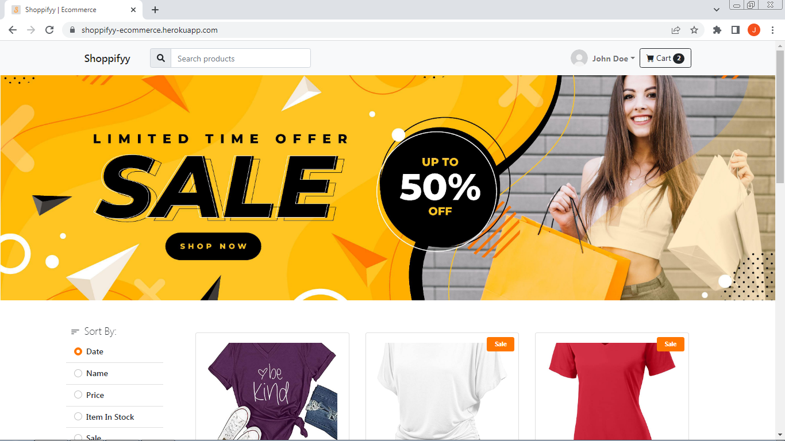
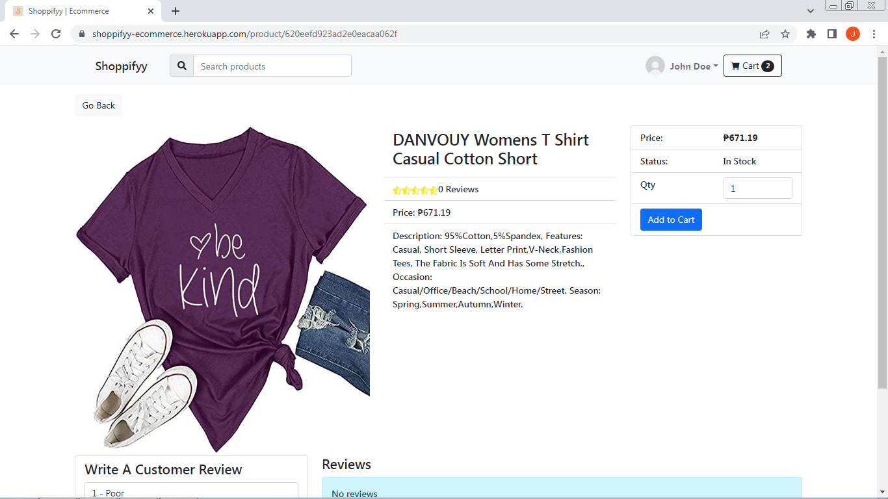

## Shoppifyy  (ecommerce app)

An ecommerce application built from scratch using MongoDB, Express, React, NodeJs (MERN stack).
It is fully fuctional from listing products, add to cart, orders and even payment
Admin user can manage users, products and orders from the dashboard

[See project live](https://shoppifyy-ecommerce.herokuapp.com/)

## Technology used

#### Backend:
* NodeJs with Express Framework
* MongoDB with mongoose ODM
* JWT
* Google OAuth

#### Frontend
* React JS 
* Redux
* React Router Dom v6
* Paypal
* Bootsrap

## Features 

* Admin can manage users, products and orders in Dashboard
* Product reviews and ratings
* Add to cart
* Accept Paypal as payment gateway
* Authentication using JWT and Google OAuth
* Infinite Scrolling / Lazy Loading
* Product filtering
* Product Sales and Discounts

## Project Screen Shot(s)

 
 

## Installation and Setup Instructions

Clone down this repository. You will need `node` and `npm` installed globally on your machine.  

Installation:

`npm install` 

`cd client && npm install`

To Start Server:

`npm run server`  

To Start Client:

`npm run client`  

To Start both Frontend and Server:

`npm run dev`  

## Reflection

  This is month long projet i made during my college years. It may look like simple on the surface but it touches so many things like implementing relationships between users, products and orders. Plus the implementation of payment gateways.
  
  Developing the project was fun and challenging i ran into problems when implementng paypal api since it was new to me at that point, but find a way by reading the docs.
  
  I decide which language/framework to use in backend. but i decided to use nodejs with express since it is my prefered backend language and framework.
  
  Medium size projects to big projects is where frontend frameworks shines. I use React with redux to build the frontend. Its really easy building frontends with react compare to HTML and vanila js.

  Overall, building this ecommerce project was fun. I am now knowledgeable in building ecommerce sites. I look forward in making this a multi seller ecommerce when i have the time.